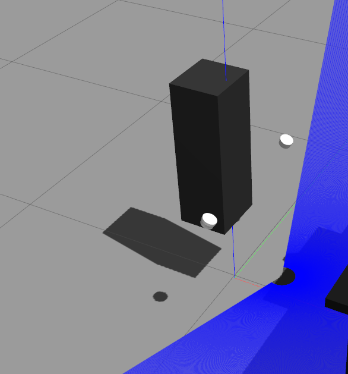

# AIRLab Retail Store Simulation


Welcome to the official AIRLab Retail Store Simulation. The goal of this repository is to allow people to work on any of the robots from AIRLab entirely in simulation (currently only TIAGo is supported). There are a number of different gazebo worlds to choose from, including one resembling the actual store in RoboHouse.

## Installation

Clone this repository in your catkin_ws and clone dependencies specified in `retail_store_simulation.rosinstall`. The dependencies listed in this file are required to build from source. To automate the process of cloning all dependencies, [vcstool](http://wiki.ros.org/vcstool) is used:

``` bash
mkdir -p <my_catkin_ws>/src # if no catkin_ws yet
cd <my_catkin_ws>/src
git clone git@gitlab.tudelft.nl:airlab-delft/ng-staging/retail_store_simulation.git
vcs import --input retail_store_simulation/retail_store_simulation.rosinstall .
cd ..
```

Next, use rosdep to install other dependencies:
``` bash
sudo rosdep init
rosdep update
rosdep install --from-paths src --ignore-src --rosdistro melodic --skip-keys="opencv2 opencv2-nonfree pal_laser_filters speed_limit_node sensor_to_cloud hokuyo_node libdw-dev python-graphitesend-pip python-statsd pal_filters pal_vo_server pal_usb_utils pal_pcl pal_pcl_points_throttle_and_filter pal_karto pal_local_joint_control camera_calibration_files pal_startup_msgs pal-orbbec-openni2 dummy_actuators_manager pal_local_planner gravity_compensation_controller current_limit_controller dynamic_footprint dynamixel_cpp tf_lookup slam_toolbox joint_impedance_trajectory_controller cartesian_impedance_controller omni_base_description omni_drive_controller"
```
> Note: the skip-keys contain non-essential dependencies and are taken from the official [PAL install instructions](http://wiki.ros.org/Robots/TIAGo%2B%2B/Tutorials/Installation/InstallUbuntuAndROS)

Finally build the catkin_ws:
``` bash
catkin build && source devel/setup.bash
```

## Quickstart

For gazebo to know about the models and worlds stored in this repository we need to export a couple of environment variables. Before running the simulation make sure to run the following shell script.

``` bash
roscd retail_store_simulation
source scripts/set_gazebo_env.sh
```

The simulation can be started with the following roslaunch file.

```
roslaunch retail_store_simulation simulation.launch
```

Specify via arguments which robot you would like to use, what world you would like to spawn in and a number of other available options (check the roslaunch file).

## Troubleshooting

**Important**
If you are using this simulation to work on the course Knowledge Reasoning and Representation (KRR) and you are working on windows through a virtual machine, please use the following world `krr_walls.world`. A bug in the integration of gazebo with virtual 3D HW is causing the depth camera detections to be corrupt. The simulation in the course can now be launched using:

```
roslaunch retail_store_simulation simulation.launch world:=krr_walls rviz:=true
```


If your simulation is launching but the model of tiago looks as follows:



This means some paths in the world file refering to the model cannot be found. Usually this happens when the world was saved by someone else or on another computer.
